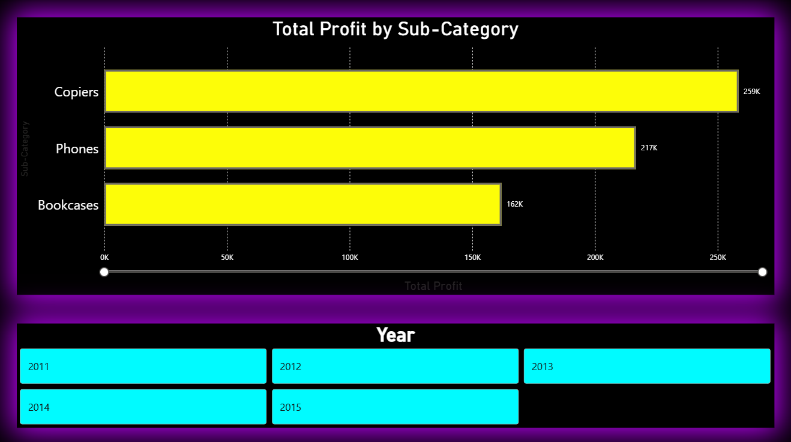
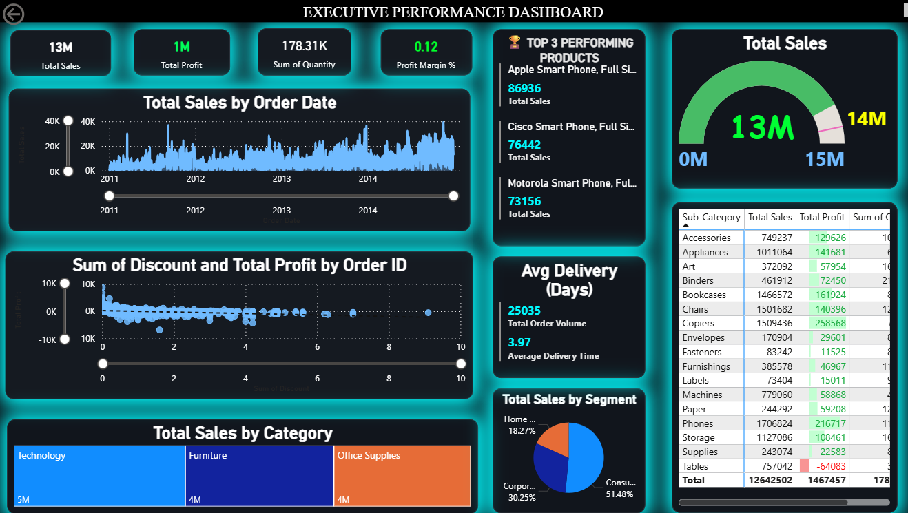
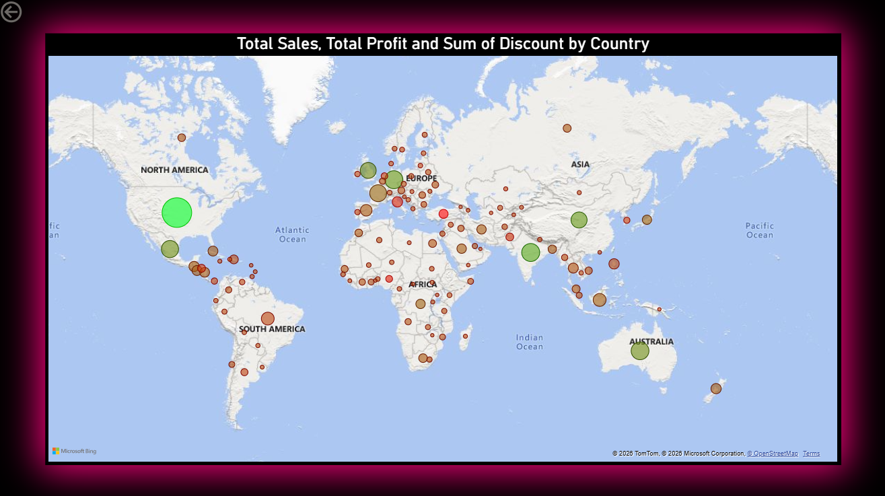

# 📊 Global Sales & Executive Command Center

## Project Overview

A multi-page executive dashboard designed to provide a comprehensive view of global sales performance. The dashboard combines financial KPIs, geographic analysis, and operational reporting into a single interactive reporting solution.

---

## Business Objectives

- Monitor global sales performance
- Analyze regional markets
- Evaluate category performance
- Support executive reporting

---

## Dashboard Highlights

### Executive KPIs

- Revenue: **$13M**
- Profit: **$1M**
- Sales Volume: **178K**

### Geographic Analysis

- Interactive sales maps
- Regional comparison
- Market performance

### Operational Reporting

- Category analysis
- Date filtering
- Multi-page navigation

---

## Tools Used

- Microsoft Power BI
- Power Query
- DAX
- Excel

---

## Skills Demonstrated

- Interactive Dashboard Design
- Geographic Analysis
- Executive Reporting
- Business Intelligence

---

## Business Value

Supports executive decision-making by combining financial performance, geographic analysis, and operational reporting into a unified dashboard experience.

## Dataset

This project uses a sample sales dataset for educational and portfolio purposes. The dashboard demonstrates business intelligence techniques including data modeling, KPI reporting, interactive visualization, and analytical storytelling.
